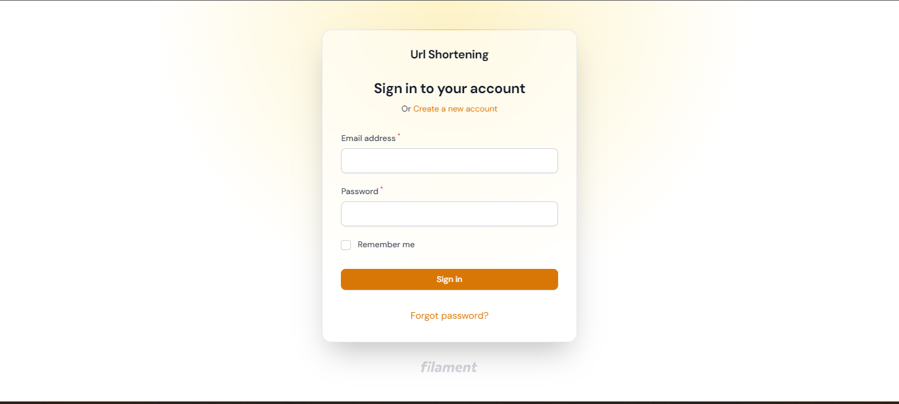
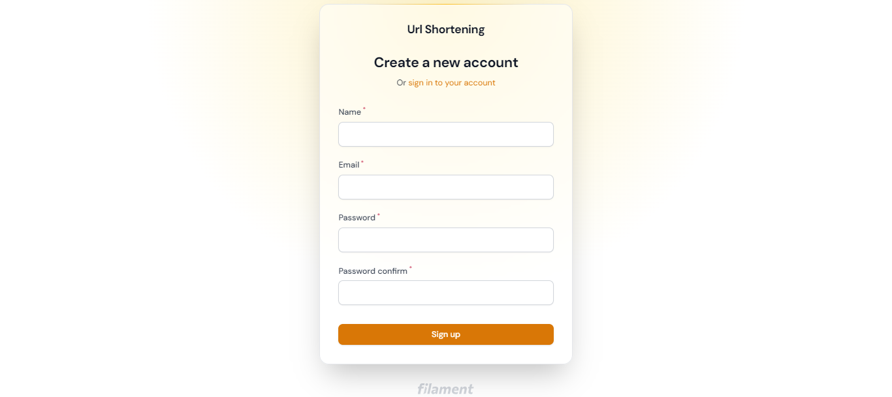
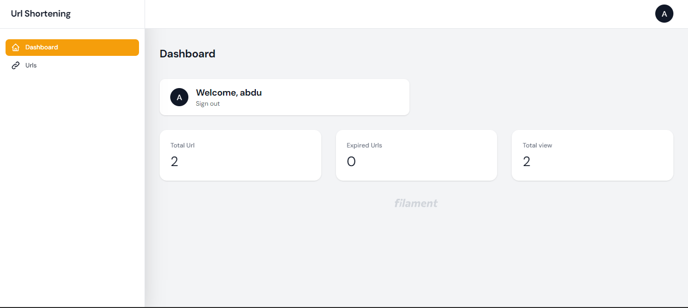
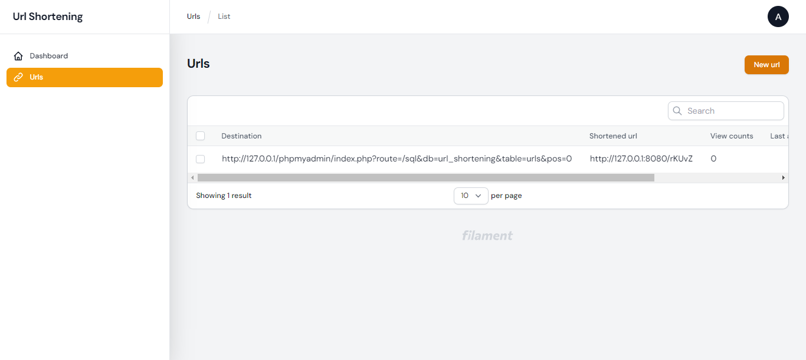
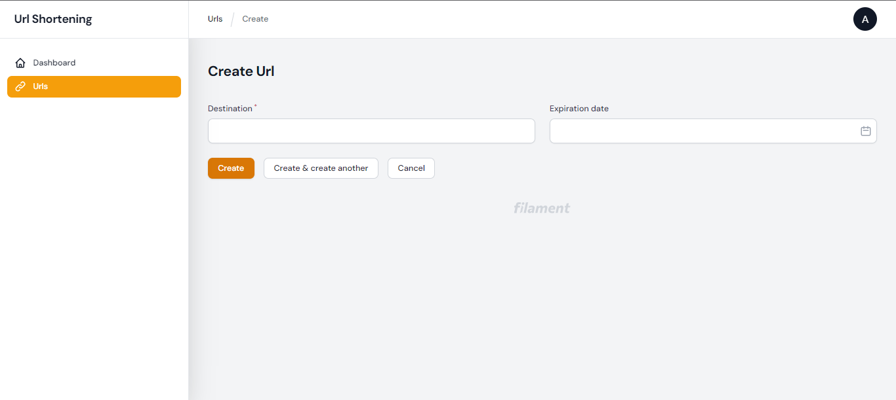
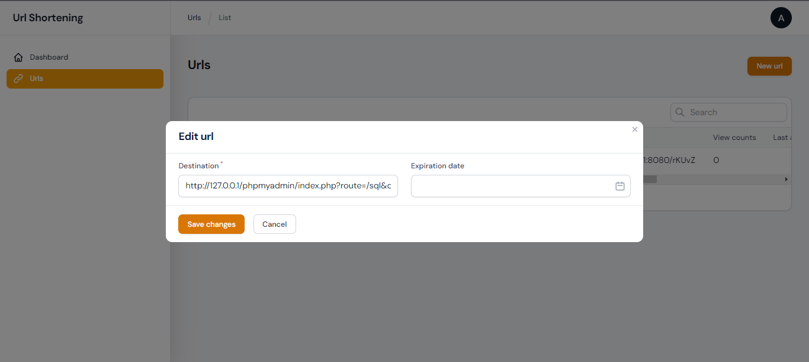
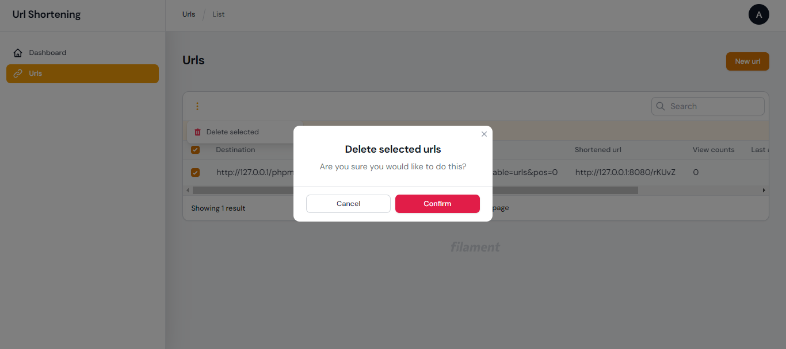

# Laravel URL Shortening Website

This is a URL shortening website built with Laravel. It allows users to shorten long URLs into smaller, more manageable URLs.
You can set an expiration date if you need to be live for specific time.

## Table of Contents

- [Features](#features)
- [Installation](#installation)
- [Usage](#usage)
- [API Documentation](#api-documentation)
- [Contributing](#contributing)
- [Screenshots](#screenshots)

## Features

- Landing page at /home
- Admin pages at /admin prefix
  - Login and registration
  - Dashboard to track statistics
  - CRUD operations for URLs
- REST API authentication using Laravel Sanctum

## Installation

1. Clone the repository:

```bash
git clone https://github.com/abduselam1/url-shortening.git
```


2. Install dependencies with Composer:


```bash
composer install
```


3. Set up the environment variables by renaming .env.example file to .env and updating the necessary values like database configuration.

4. Generate an application key:

```bash
php artisan key:generate
```


5. Run migrations and seed the database:

```bash
php artisan migrate --seed
```

6. Start the development server:

```bash
php artisan serve
```

The application should now be running locally at http://localhost:8000.

## Usage

- Visit the landing page at /home to access the URL shortening service.
- Users can create an account or log in to manage their URLs and view statistics on the dashboard.
- Use the CRUD operations in the admin section at /admin to manage URLs.
- REST API endpoints are available for authentication and creating URLs.

## API Documentation

### Login
Before you access any url endpoints you have to authorize
```bash
/api/login *Post*
```
#### parameters
#### email _required_, _email_
you have to set an email
#### password _required_, min:8 
You need to provide a password with minimum of 8 characters

#### Return _Array_
##### Index 0 _Bearer Token_
##### Index 1 _User data_

### Registration
With this end point we can register to our system
```bash
/api/register *Post*
```
#### parameters
#### email _required_, _email_
you have to set an email
#### password _required_, min:8 
You need to provide a password with minimum of 8 characters
#### password_confirmation _required_,  
your password confirmation must match with your password

#### password_confirmation _required_  
your name

#### Return _Array_
##### Index 0 _Bearer Token_
##### Index 1 _User data_

### Create short Url
With this end point we can register to our system
```bash
/api/urls *POST*
```
#### destination _required_, _url_
Destination needs to be url string and its required
#### expiration_date _Optional_, _date_ 

### Get your Url
/api/urls *GET*
```
### Get your Url
/api/urls/{id} *GET* _id_ *required*
```


## Contributing

Contributions are welcome! Please feel free to submit any bug fixes, enhancements, or new features as pull requests.

## Screenshots







